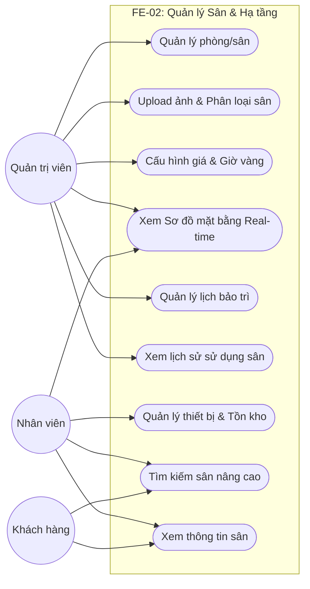
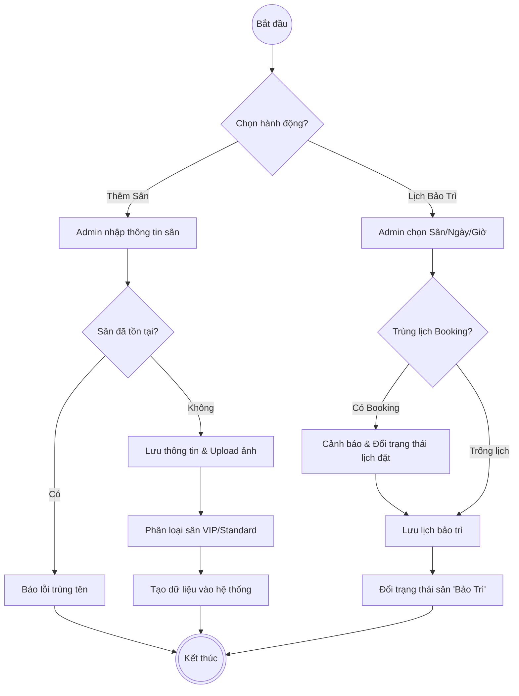
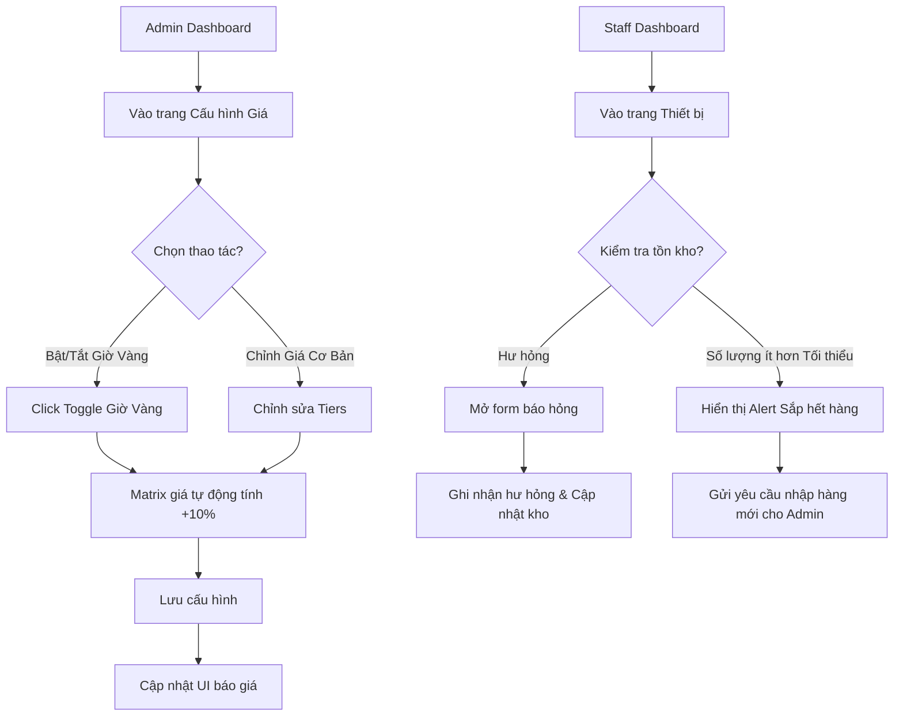
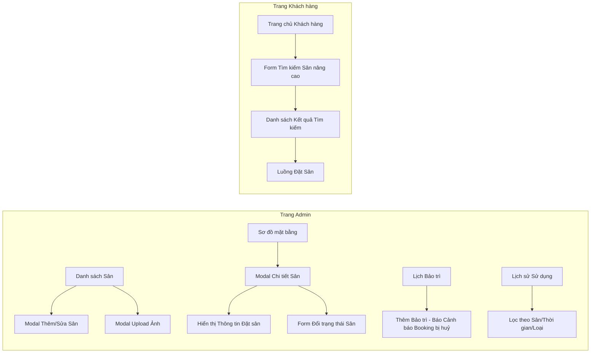
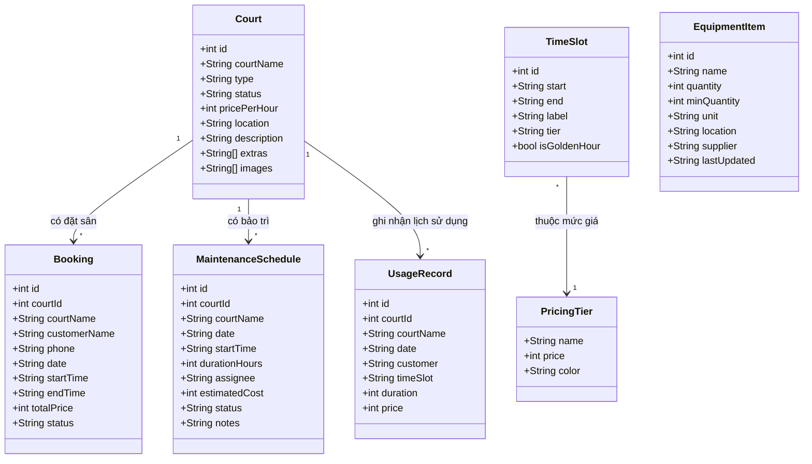

# FE-02: Quản Lý Sân & Hạ Tầng - System Diagrams

Tài liệu này chứa các biểu đồ hệ thống cho module quản lý sân và hạ tầng (FE-02).

## 1. Use Case Diagram

Biểu đồ mô tả các chức năng chính của người dùng, nhân viên và quản trị viên đối với module quản lý sân.

## 2. Activity Diagram: Quy trình Thêm và Bảo trì Sân

Quy trình mô tả chuỗi hành động khi Admin thêm sân mới hoặc tạo lịch bảo trì.

## 3. User Flow: Quản lý Giá & Tồn Kho

Luồng thao tác của người dùng trên UI khi thay đổi giá năng động hoặc kiểm tra tồn kho.

## 4. Screen Flow: Trải nghiệm Giao diện Sơ đồ mặt bằng & Lịch sử sử dụng

Sơ đồ luồng di chuyển giữa các màn hình trong module này.

## 5. Class Diagram (Biểu đồ Lớp)

Cấu trúc dữ liệu các thực thể chính trong FE-02.

